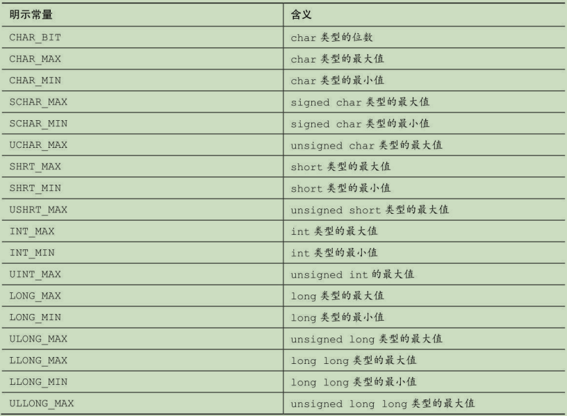
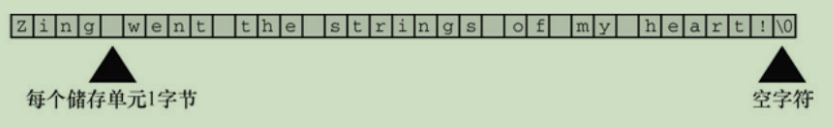
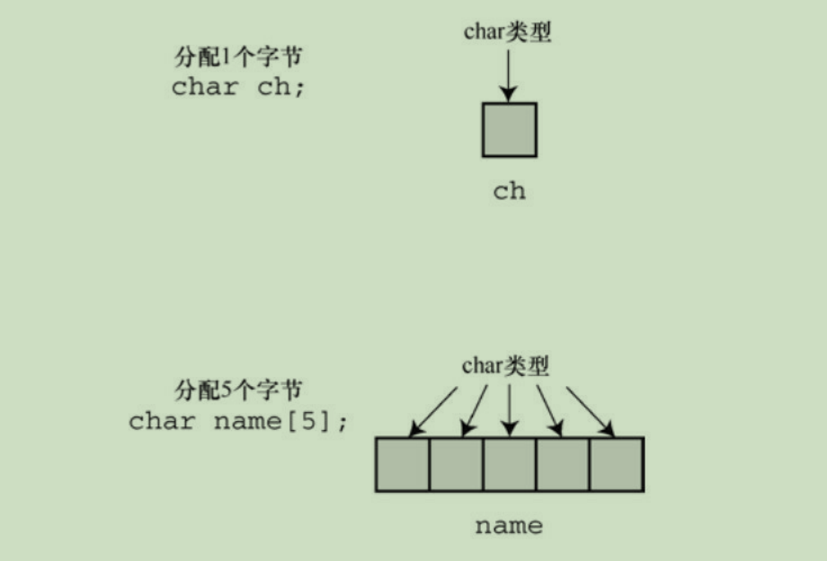

# c11

# 类型系统

## 整数部分
### short

### int

### long

### long long

### 定义字节数
```text
int ——系统给定的基本整数类型。C语言规定int类型不小于16位。
short或short int ——最大的short类型整数小于或等于最大的int类型整
数。C语言规定short类型至少占16位。
long或long int ——该类型可表示的整数大于或等于最大的int类型整数。
C语言规定long类型至少占32位。
long long或long long int ——该类型可表示的整数大于或等于最大的long
类型整数。Long long类型至少占64位。
```

### limits.h


## 浮点部分
### float

### double
## 溢出
### int类型溢出
1. 上溢： 上溢之后从最小的开始
2. 下溢： 下溢之后从最大的开始

### float类型溢出
1. 上溢： inf
2. 下溢： 0.0000e-32
   1. 为什么下溢之后会这样：因为float的存储方式是以指数的形式存储，
      比如 0.2 = 2e-1 ,除以10，变成2e-2；
      这时，如果已经表示最小数了，然后现在要除以一个数字，就只有移动数字部分
      如果除以一个非常大的数字，则所有数字都变成0，指数则是最大的指数


## 字符类型
char 一个字节

## 派生类型

### 数组
char a[40] 定长数组。其实a就是个地址，为什么？因为scanf("%s",a);  
数组由连续的存储单元组成，字符串中的字符被储存在相邻的存储单元中，每个单元储存一个字符   
  
也就是说，40个长度的数组，只能储存39个字符，剩下一个字节留给空字符

 声明一个变量和声明一个数组  


### 有点奇怪
char name[40];  我输入长度大于40，还是会装下 ，明明都超出了

## 输入输出

### scanf
```c
// 只贴关键代码
void inputName(void)
{
    char name[40];
    scanf("%s",name);
    printf("Hello, %s.%s\n", name, NAME);
}
// 这里。如果你输入的时候，中间带有空格、制表符或换行符，则后面的不会被读取到
```
